# CoGraph — Concepts & Technology Explained

This document explains every concept, tool, and technology used in the CoGraph project. Read this before diving into the code.

---

## Table of Contents

1. [The Big Picture](#1-the-big-picture)
2. [Knowledge Graphs & Neo4j](#2-knowledge-graphs--neo4j)
3. [The Ontology](#3-the-ontology)
4. [Data Sources](#4-data-sources)
5. [Deterministic Parsers](#5-deterministic-parsers)
6. [Embeddings & Vector Search](#6-embeddings--vector-search)
7. [LLM (Large Language Model)](#7-llm-large-language-model)
8. [The 8-Stage Ingestion Pipeline](#8-the-8-stage-ingestion-pipeline)
9. [Entity Resolution](#9-entity-resolution)
10. [Provenance](#10-provenance)
11. [The Query Layer (RAG)](#11-the-query-layer-rag)
12. [Evaluation (RAGAS)](#12-evaluation-ragas)
13. [Supporting Tools](#13-supporting-tools)
14. [How Everything Fits Together](#14-how-everything-fits-together)

---

## 1. The Big Picture

Imagine you're a red teamer (someone who tests an organisation's security by simulating attacks). You need to answer questions like:

- "What tools can I use to steal Kerberos tickets?"
- "What defences exist against Pass-the-Hash?"
- "Which threat groups target Active Directory?"

The answers are scattered across dozens of sources: MITRE ATT&CK, blog posts, tool documentation, community wikis — all in different formats. CoGraph solves this by:

1. **Collecting** data from these sources
2. **Structuring** it into a knowledge graph (nodes and edges)
3. **Querying** the graph with natural language, getting answers with citations

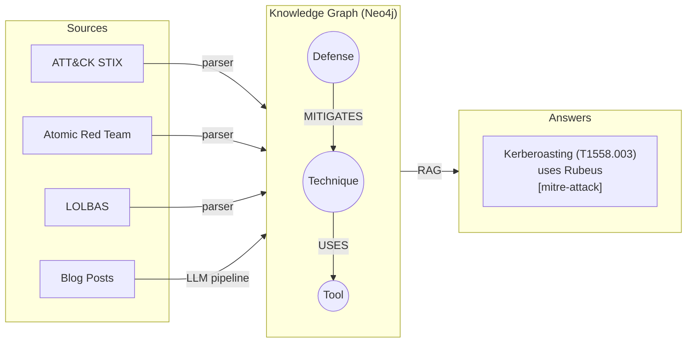

---

## 2. Knowledge Graphs & Neo4j

### What is a knowledge graph?

A knowledge graph stores information as **nodes** (things) and **edges** (relationships between things). Think of it like a mind map, but machine-readable.

Example:

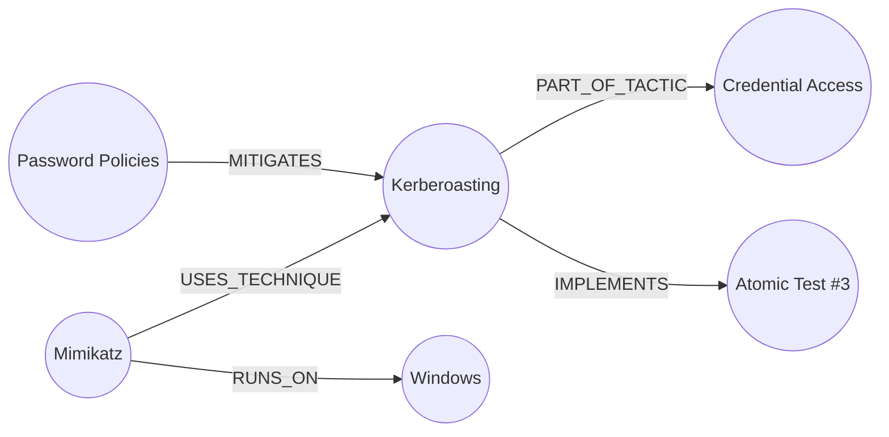

Unlike a table in a relational database, a knowledge graph excels at **traversing relationships** — "find all tools used by groups that target Active Directory" is one query, not five JOINs.

### What is Neo4j?

Neo4j is the most popular **graph database**. It stores nodes and edges natively (not as tables). You query it with **Cypher**, a graph query language:

```cypher
-- "What tools does APT29 use for credential access?"
MATCH (g:IntrusionSet {name: "APT29"})-[:USES_TECHNIQUE]->(t:Technique)-[:PART_OF_TACTIC]->(ta:Tactic {name: "Credential Access"})
MATCH (tool:Tool)-[:USES_TECHNIQUE]->(t)
RETURN tool.name, t.name
```

We run Neo4j in a **Docker container** — a lightweight virtual machine that you start with `docker compose up -d neo4j`. You interact with it via:
- **Browser UI**: http://localhost:7474 (visual graph explorer)
- **Bolt protocol**: port 7687 (programmatic access from Python)

### What is APOC?

APOC (Awesome Procedures On Cypher) is a Neo4j plugin that adds hundreds of utility functions — batching, text search, import/export, etc. We enable it in docker-compose.yml. You don't interact with it directly.

---

## 3. The Ontology

An **ontology** is a formal definition of "what kinds of things exist and how they can relate". It's the schema of our knowledge graph. Ours is defined in `src/cograph/ontology/schema.py`.

### Ontology overview

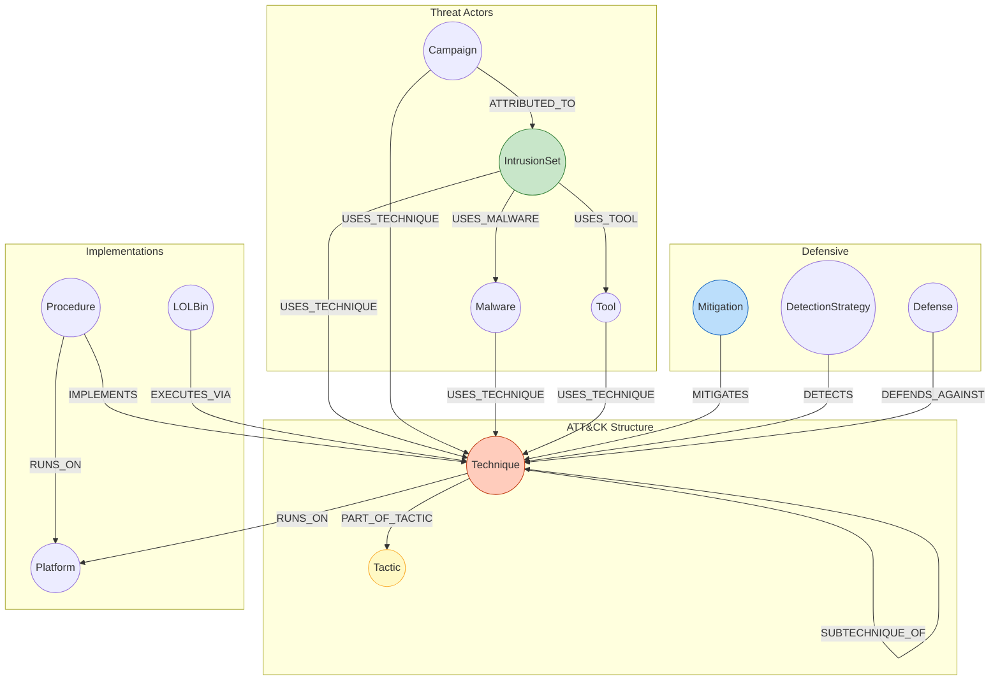

### Entity types (13 node labels)

| Label | What it represents | Example |
|-------|-------------------|---------|
| `Technique` | An attack method | T1558.003 — Kerberoasting |
| `Tactic` | A phase of an attack (the "why") | TA0006 — Credential Access |
| `Malware` | Adversary-written malicious software | S0386 — Ursnif |
| `Tool` | Legitimate software abused by attackers | S0002 — Mimikatz |
| `IntrusionSet` | A threat actor group | G0016 — APT29 |
| `Campaign` | A named operation by a group | C0027 |
| `Mitigation` | A defence / countermeasure | M1026 — Privileged Account Mgmt |
| `DataComponent` | A data source for detection | DC0084 |
| `DetectionStrategy` | A detection approach (ATT&CK v18+) | DET0237 |
| `Procedure` | A concrete test script (Atomic Red Team) | T1003.001:::guid |
| `LOLBin` | A built-in Windows binary abusable by attackers | Certutil.exe |
| `Platform` | An operating system | Windows, Linux, macOS |
| `Defense` | A D3FEND countermeasure (or LLM-extracted) | TBD |

### Relationship types (20 edge types)

Examples:
- `(Mimikatz)-[USES_TECHNIQUE]->(Kerberoasting)` — "Mimikatz implements Kerberoasting"
- `(Kerberoasting)-[PART_OF_TACTIC]->(Credential Access)` — "Kerberoasting is a credential access technique"
- `(Mitigation)-[MITIGATES]->(Technique)` — "this defence helps against this attack"
- `(Procedure)-[IMPLEMENTS]->(Technique)` — "this Atomic Red Team test demonstrates this technique"

### Uniqueness constraints

Every node type has a **unique key** — a property that must be unique across all nodes of that label. For example, no two `Technique` nodes can have the same `attack_id`. This prevents duplicates and makes lookups fast. These are enforced in `schema_init.cypher`.

---

## 4. Data Sources

### MITRE ATT&CK (STIX JSON)

ATT&CK is the industry-standard catalogue of adversary tactics, techniques, and procedures. It contains ~835 techniques, ~700 malware families, ~187 threat groups, etc.

The data is published in **STIX format** (Structured Threat Information eXpression) — a JSON standard for cyber threat intelligence. Our file `enterprise-attack.json` contains 24,772 STIX objects.

**Key challenge**: the STIX `uses` relationship is overloaded — it means different things depending on the source/target types (malware uses technique, group uses tool, etc.). Our parser dispatches on the type pair.

### Atomic Red Team (YAML)

Atomic Red Team is a library of **executable test scripts** — one per ATT&CK technique. Each YAML file describes concrete commands you can run to test whether a technique works. For example, T1558.003.yaml contains the actual `Rubeus.exe kerberoast` command.

We parse these into `Procedure` nodes linked to their parent `Technique` via `IMPLEMENTS` edges.

### LOLBAS (JSON)

LOLBAS (Living Off the Land Binaries and Scripts) catalogues Windows built-in binaries that attackers abuse. For example, `Certutil.exe` is a legitimate certificate tool that can also download files from the internet.

Each entry includes the binary name, commands, MITRE technique mappings, and Sigma detection rules.

### D3FEND (not yet available)

D3FEND is the defensive counterpart to ATT&CK — it maps defences to attack techniques. We have a stub parser ready for when the data arrives.

---

## 5. Deterministic Parsers

"Deterministic" means these parsers use **fixed rules, not AI** — they always produce the same output for the same input. They're fast, reliable, and produce the **structured backbone** of the graph (~3,500 nodes, ~26,000 edges).

Each parser reads its data source and outputs two flat lists:
- **NodeRecords**: `{label: "Technique", properties: {attack_id: "T1558.003", name: "Kerberoasting", ...}}`
- **RelRecords**: `{source: "Mimikatz", rel_type: "USES_TECHNIQUE", target: "T1558.003", provenance: {...}}`

These are then bulk-loaded into Neo4j using `MERGE` (upsert) statements.

**Load order matters**: ATT&CK first (creates Technique nodes), then Atomic RT and LOLBAS (which reference those Techniques).

---

## 6. Embeddings & Vector Search

### What is an embedding?

An embedding is a way to represent text as a **list of numbers** (a vector). Similar texts get similar vectors. This lets us do **semantic search** — finding relevant content by meaning, not just keyword matching.

```
"Kerberoasting attack"     → [0.23, -0.81, 0.45, ..., 0.12]  (1024 numbers)
"Steal Kerberos tickets"   → [0.21, -0.79, 0.43, ..., 0.14]  (very similar!)
"How to make pizza"        → [-0.65, 0.33, -0.12, ..., 0.88] (very different)
```

### What is BGE-large-en-v1.5?

It's the specific **embedding model** we use. Made by BAAI (Beijing Academy of AI), it converts text into 1024-dimensional vectors. It runs locally on your machine (no API needed) via the `sentence-transformers` library.

We embed each entity's `name + description` and store the vector as a property on the node.

### How does vector search work in Neo4j?

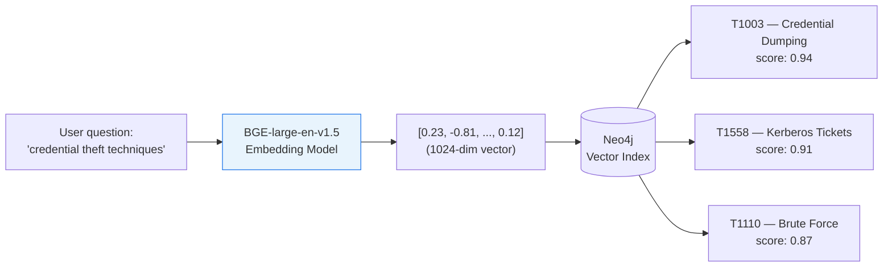

Neo4j has built-in **vector indexes**. When you ask "What techniques relate to credential theft?", we:
1. Embed your question with BGE-large → get a 1024-dim vector
2. Ask Neo4j: "find the 5 nodes whose embedding vectors are most similar" (cosine similarity)
3. Neo4j returns the top-5 matches, ranked by similarity score

This is much more powerful than keyword search because it understands **meaning**: "credential theft" matches "password dumping" even though they share no words.

---

## 7. LLM (Large Language Model)

### What is an LLM?

A large language model (like GPT-4, Gemini, Llama) is an AI that understands and generates text. In CoGraph, we use an LLM for three things:

1. **Entity extraction** (pipeline stage 3): "Read this blog post and find all attack techniques, tools, and threat groups mentioned."
2. **Relation extraction** (pipeline stage 4): "Given these entities, what relationships exist between them?"
3. **Answer generation** (query layer): "Given this graph context, answer the user's question with citations."

### Which LLM do we use?

Configurable via `.env`:

| Provider | Setting | When to use |
|----------|---------|-------------|
| **Google Gemini** | `COGRAPH_LLM_PROVIDER=google` | Default — free tier available, good quality |
| **OpenAI** | `COGRAPH_LLM_PROVIDER=openai` | If you have an OpenAI key |
| **vLLM** | `COGRAPH_LLM_PROVIDER=vllm` | Self-hosted 70B model on GPU server (stackIT) |

The LLM is accessed via the **OpenAI-compatible API** — all three providers expose the same interface, so our code works with any of them.

### What is vLLM?

vLLM is a high-performance **LLM serving engine** for self-hosted models. If you have a GPU server, you can run a 70B-parameter model (Qwen 2.5 or Llama 3.1) locally. This avoids API costs and keeps data private. We include it in docker-compose.yml but it's behind a `gpu` profile — it only starts if you explicitly ask for it.

---

## 8. The 8-Stage Ingestion Pipeline

The pipeline is for **unstructured sources** (blog posts, wiki pages, tool docs) — content that doesn't have a fixed format. The deterministic parsers handle structured sources; the pipeline handles everything else.

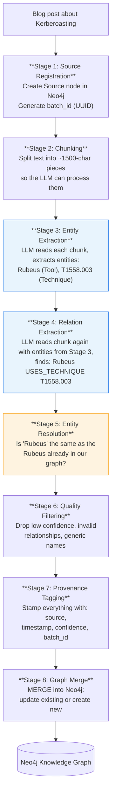

### Why two separate LLM passes?

Stage 3 (entities) and Stage 4 (relations) are separate to **reduce hallucination**. If you ask an LLM to extract everything at once, it tends to invent relationships that don't exist in the text. By extracting entities first and then asking "what relationships exist between *these specific entities*?", the LLM is more constrained and accurate.

### Why chunking?

LLMs have a limited context window (how much text they can read at once). A blog post might be 10,000 words, but the LLM works best on ~1,500 characters at a time. Chunking splits the text into overlapping pieces so nothing is missed at the boundaries.

---

## 9. Entity Resolution

Entity resolution is the problem of **recognising that two different mentions refer to the same thing**. This is critical when ingesting multiple sources:

- Blog post says "Kerberoasting"
- ATT&CK says "Steal or Forge Kerberos Tickets: Kerberoasting (T1558.003)"
- Another blog says "Kerberos TGS ticket roasting"

These are all the same technique. Without entity resolution, you'd get three separate nodes instead of one.

### Three-tier cascade

We use three increasingly expensive methods, in order:

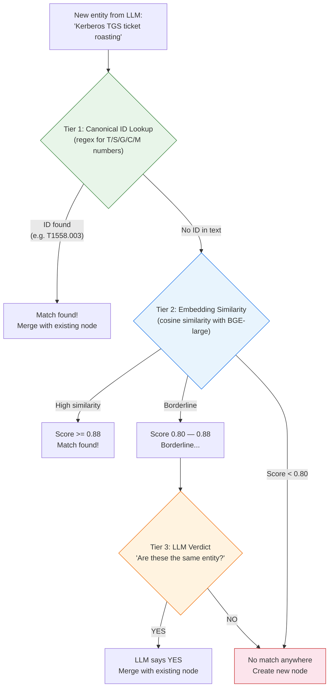

**Tier 1 — Canonical ID Lookup** (instant, free)

If the text contains an ATT&CK ID (T-number, S-number, etc.), we extract it with a regex and look it up directly. Example: `"Kerberoasting (T1558.003)"` → regex finds `T1558.003` → look up in graph → match! This catches ~70% of cases.

**Tier 2 — Embedding Similarity** (fast, no LLM needed)

If no ID is found, we embed the entity's name and compare it to existing nodes using vector similarity. Example: `"Kerberos TGS ticket roasting"` → embed → T1558.003 has cosine similarity 0.92 → match! (threshold is 0.88).

**Tier 3 — LLM Verdict** (slow, costs one LLM call)

For borderline cases (similarity between 0.80 and 0.88), we ask the LLM: *"Are 'Kerberos TGS roasting' and 'T1558.003 Kerberoasting' the same?"* → LLM: *"YES — both refer to requesting TGS tickets and cracking them offline."* This is expensive, so it only runs when Tiers 1 and 2 are inconclusive.

---

## 10. Provenance

Provenance means **tracking where every piece of data came from**. In CoGraph, every relationship in the graph carries metadata:

| Property | Meaning | Example |
|----------|---------|---------|
| `source_name` | Which dataset | `"mitre-attack"`, `"atomic-red-team"`, `"llm-extracted"` |
| `source_url` | Original URL or file path | `"https://attack.mitre.org"` |
| `confidence` | How reliable (0.0–1.0) | `1.0` for parsers, `0.7` for LLM |
| `batch_id` | Which ingestion run | UUID for traceability |
| `extracted_at` | Timestamp | `"2026-04-16T14:30:00Z"` |
| `stix_description` | CTI context from STIX | `"APT29 used Mimikatz to dump credentials"` |

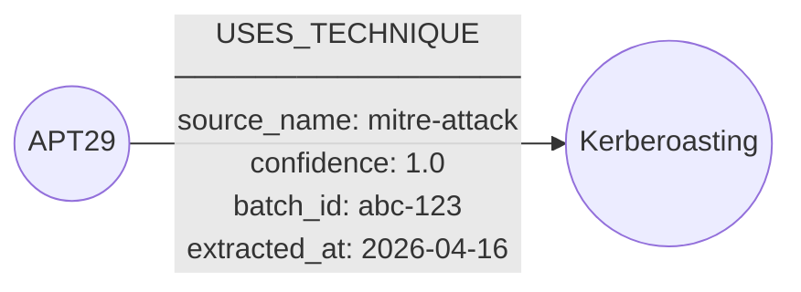

### Why provenance matters

1. **Citations**: when the query layer answers a question, it can cite which source each fact came from — `"Kerberoasting uses TGS tickets [mitre-attack]"`
2. **Trust**: deterministic parser data (confidence=1.0) is more reliable than LLM-extracted data (confidence=0.7)
3. **Debugging**: if something looks wrong in the graph, you can trace it back to the exact source and ingestion batch
4. **Replay**: you can delete all edges from a specific `batch_id` and re-ingest if the pipeline improves

---

## 11. The Query Layer (RAG)

### What is RAG?

**RAG** (Retrieval-Augmented Generation) is a pattern where you:
1. **Retrieve** relevant context from a knowledge source
2. **Generate** an answer using an LLM, grounded in that context

Without RAG, an LLM answers from memory (which may be outdated or wrong). With RAG, the LLM answers from your actual data, with citations.

### How our hybrid retrieval works

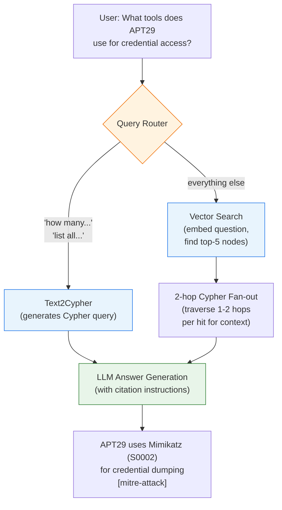

### Two retrieval modes

**Vector + Graph (default)**: for open-ended questions ("What can I do with domain user access?")
- Embed the question → find semantically similar nodes → traverse their graph neighborhood → feed everything to the LLM

**Text2Cypher**: for structural questions ("How many techniques target Kerberos?")
- The LLM generates a Cypher query directly → execute against Neo4j → return raw results
- This is better for counting, listing, and aggregate queries

### The 2-hop fan-out

When vector search finds a matching node (e.g., "Kerberoasting"), we don't just return that node — we **traverse 2 hops** in the graph to collect context:

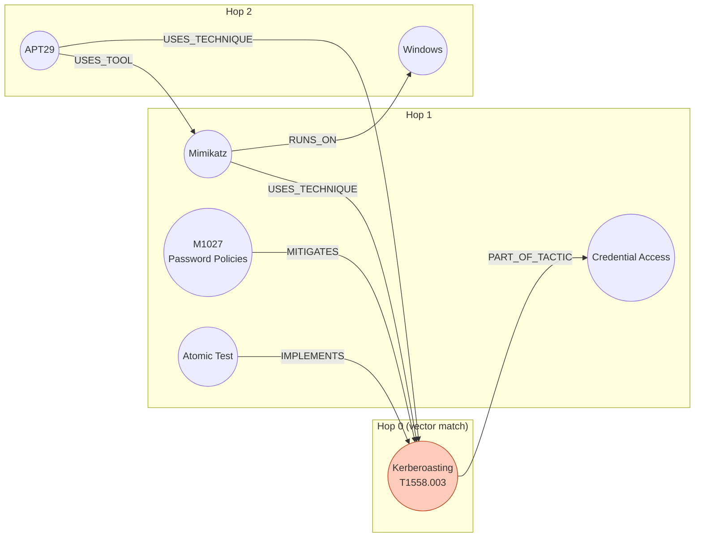

This gives the LLM rich context to generate a comprehensive answer. We limit to 2 hops because the ATT&CK graph is highly connected — 3 hops would return thousands of nodes and overwhelm the LLM.

---

## 12. Evaluation (RAGAS)

### What is RAGAS?

RAGAS (Retrieval Augmented Generation Assessment) is a framework for evaluating RAG systems. It measures whether your system retrieves the right context and generates correct, grounded answers.

### Our 6 metrics

| Metric | What it measures | Target |
|--------|-----------------|--------|
| **Citation Accuracy** | Are the `[source_name]` citations in the answer actually backed by the retrieved context? | >= 85% |
| **Factual Correctness** | Do the facts in the answer match the gold-standard answer? | >= 80% |
| **Graph Coverage** | Did the retriever find the entities that should have been found? | >= 75% |
| **Retrieval Relevance** | Is the retrieved context relevant to the question? | measured |
| **Answer Completeness** | Does the answer cover all key points? | measured |
| **Faithfulness** | Is the answer grounded in the retrieved context (not hallucinated)? | measured |

### The benchmark

`questions.yaml` contains 30 questions across 3 difficulty tiers:

- **Easy (10)**: single-hop lookups — "What tactic does T1558 belong to?"
- **Medium (10)**: multi-hop reasoning — "What tools does APT29 use for credential access?"
- **Hard (10)**: attack chain synthesis — "Design a credential theft chain from phishing to domain admin"

Each question has a **gold-standard answer** and a list of **required entity IDs** (for graph coverage).

### LLM-as-judge

For metrics that need semantic understanding (factual correctness, completeness), we use the LLM itself as a judge. To validate this approach, we **calibrate** by:
1. Human-labeling 50 question-answer pairs
2. Running the LLM judge on the same pairs
3. Computing agreement (target: 85%)

If the LLM judge disagrees with humans too often, we refine the judging prompt.

---

## 13. Supporting Tools

### Docker & Docker Compose

**Docker** packages applications into containers — lightweight, isolated environments that run identically everywhere. **Docker Compose** defines multi-container setups in a YAML file.

Our `docker-compose.yml` defines:
- `neo4j` — the graph database (always needed)
- `vllm` — self-hosted LLM (only if you have GPUs)
- `langfuse` + `langfuse-db` — observability (optional)

### Langfuse

Langfuse is an **LLM observability platform** — it logs every LLM call (prompt, response, latency, cost) so you can debug and improve your pipeline. It's optional. If you don't set `LANGFUSE_SECRET_KEY` in `.env`, it's silently skipped.

Think of it as "browser DevTools but for LLM applications" — you can see every call the pipeline made, how long it took, what the LLM returned, etc.

### Pydantic

Pydantic is a Python library for **data validation using type hints**. Instead of passing raw dicts around, we define models like:

```python
class Technique(BaseModel):
    attack_id: str          # must be a string
    name: str = ""          # default empty
    platforms: list[str]    # must be a list of strings
```

If you try to create `Technique(attack_id=123)`, Pydantic raises an error because `123` is not a string. This catches bugs early.

### Pydantic Settings

An extension that loads configuration from environment variables. Our `Settings` class reads `COGRAPH_NEO4J_URI` from the environment (or `.env` file) and makes it available as `settings.neo4j_uri` in Python.

### sentence-transformers

A Python library that runs embedding models locally. We use it for BGE-large-en-v1.5. It downloads the model weights (~1.3 GB) on first use and runs inference on CPU (no GPU needed, just slower).

### neo4j-graphrag-python

The official Neo4j library for building RAG applications with graphs. It provides:
- `SimpleKGPipeline` — LLM-based knowledge graph construction
- `VectorCypherRetriever` — vector search + Cypher traversal
- `Text2CypherRetriever` — natural language to Cypher query
- `GraphRAG` — full RAG pipeline (retrieval + generation)
- `OpenAILLM` — LLM wrapper compatible with OpenAI API (which Gemini also supports)

### STIX (Structured Threat Information eXpression)

A JSON standard for sharing cyber threat intelligence. ATT&CK publishes its data in STIX 2.1 format. Each object has a `type` (e.g., `attack-pattern`, `malware`, `relationship`), a unique `id`, and type-specific properties.

### Cypher

The query language for Neo4j. Key patterns:

```cypher
-- Create/update a node
MERGE (t:Technique {attack_id: "T1558.003"})
SET t.name = "Kerberoasting"

-- Find a path
MATCH (g:IntrusionSet)-[:USES_TECHNIQUE]->(t:Technique)-[:PART_OF_TACTIC]->(ta:Tactic)
WHERE g.name = "APT29" AND ta.name = "Credential Access"
RETURN t.name

-- Count
MATCH (t:Technique) RETURN count(t)
```

---

## 14. How Everything Fits Together

### Phase 1: Structured backbone (Week 1)

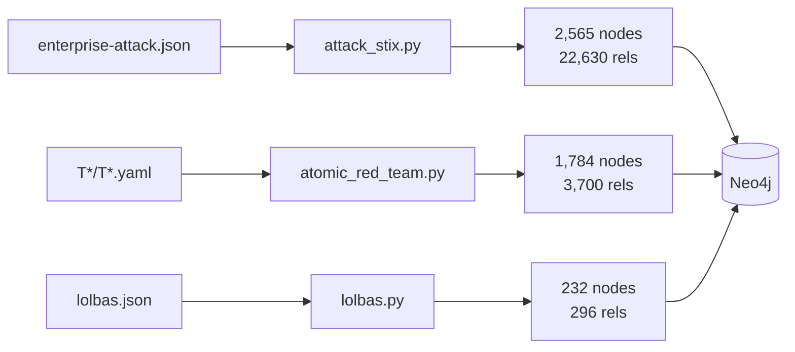

### Phase 2: LLM enrichment (Week 2)

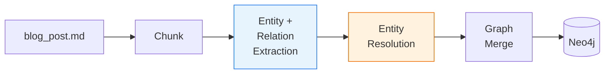

### Phase 3: Query (Week 3)

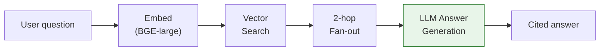

### Phase 4: Evaluate (Week 4)

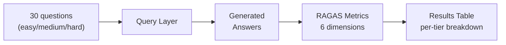

### File map

| Directory | Purpose | When |
|-----------|---------|------|
| `src/cograph/ontology/` | Schema definition (what types of things exist) | Foundation |
| `src/cograph/models/` | Python data models (Pydantic) | Foundation |
| `src/cograph/config.py` | All settings (Neo4j, LLM, thresholds) | Foundation |
| `src/cograph/utils/` | Shared clients (Neo4j, LLM, embedder) | Foundation |
| `src/cograph/parsers/` | Deterministic parsers (ATT&CK, Atomic, LOLBAS) | Week 1 |
| `src/cograph/pipeline/` | 8-stage LLM extraction pipeline | Week 2 |
| `src/cograph/query/` | Hybrid query layer (vector + Cypher + RAG) | Week 3 |
| `src/cograph/eval/` | Benchmark, metrics, LLM judge | Week 4 |
| `scripts/` | Entry-point scripts (run in numbered order) | All weeks |
